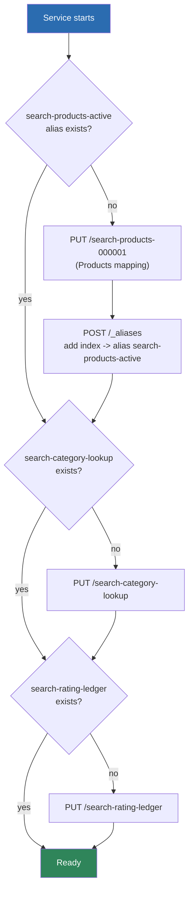
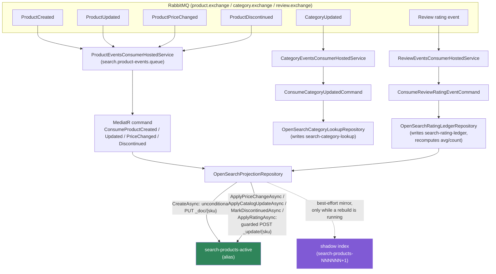
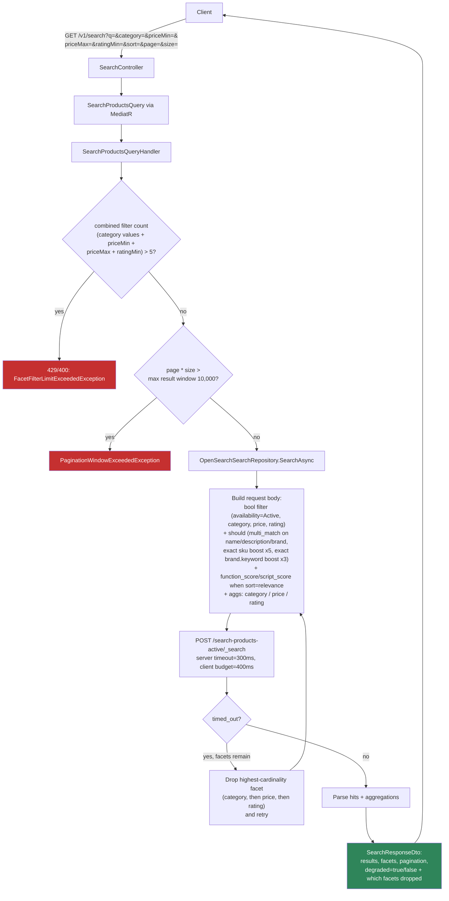
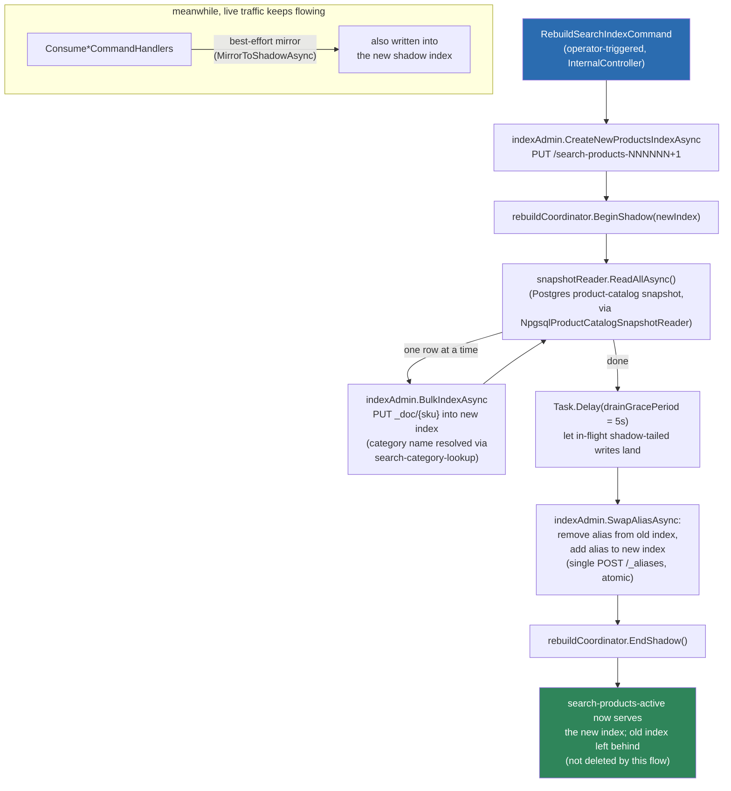

# How OpenSearch works in kart-search-service

This service has **no relational write model** — OpenSearch *is* the database. There
are three indices, all reachable only through this service:

| Index (behind alias/prefix)         | Purpose                                                              | Mapping source |
|--------------------------------------|-----------------------------------------------------------------------|----------------|
| `search-products-NNNNNN` → alias `search-products-active` | The searchable product catalog (what `GET /v1/search` queries) | [`OpenSearchIndexMappings.Products`](../src/Infrastructure/Search/OpenSearchIndexMappings.cs) |
| `search-category-lookup`             | `categoryId → categoryName` lookup, used to denormalize category names onto product docs | `OpenSearchIndexMappings.CategoryLookup` |
| `search-rating-ledger`               | Write-side-only per-review rating bookkeeping, used to recompute `avg`/`count` idempotently | `OpenSearchIndexMappings.RatingLedger` |

There is exactly **one public endpoint**, `GET /v1/search` — this service is
query-only from the outside. Everything else is driven by RabbitMQ events from
other services (product-catalog, category, review).

---

## 1. Bootstrap (startup)



`OpenSearchIndexBootstrapHostedService` runs once at startup and is idempotent
(create-if-absent, like an EF Core migration for a service with no relational
store). If OpenSearch is unreachable at boot, the exception is swallowed and
logged as a warning — the process does **not** crash; reads/writes just fail
until OpenSearch comes back and this bootstrap can be safely retried.

---

## 2. Write path — catalog/price/discontinue/rating events keep the index in sync



Key mechanics:

- **Ordering guard, not a lock.** Every scripted update
  (`OpenSearchProjectionRepository`) opens with a Painless preamble that compares
  the incoming event's `occurredAt` against the document's stored
  `lastCatalogEventAt`. If the incoming event is *not* newer, the script sets
  `ctx.op = 'noop'` and nothing is written. This makes out-of-order redelivery
  (RabbitMQ requeues, retries) safe without needing a distributed lock — the
  guard lives inside the atomic scripted update itself, so two consumers racing
  on the same `sku` can't stomp each other based on stale reads.
- **Rating is different.** `ApplyRatingAsync` has no ordering guard — ratings are
  always derived fresh from `search-rating-ledger`'s full current contents
  (`OpenSearchRatingLedgerRepository.ApplyRatingAsync` recomputes `avg`/`count`
  from every `perReviewRatings[ledgerKey]` in one round trip), so it's naturally
  idempotent regardless of delivery order.
- **Retry ladder.** Any exception in a consumer routes to `RetryLadderDispatcher`
  instead of dead-lettering immediately (not shown above for brevity) — bounces
  through retry-tier queues before giving up.
- **Shadow mirroring.** Every write also best-effort mirrors into whatever index
  `IRebuildCoordinator.ShadowIndexName` currently points to (see the rebuild
  flow below). This is how live events aren't lost while a full reindex is
  replaying from Postgres in the background. A shadow-mirror failure is only
  logged — it never fails the primary write.

---

## 3. Read path — `GET /v1/search`



Key mechanics:

- **Single-pass ranking.** When `sort=relevance` (the default), the whole query
  is wrapped in a `function_score` with `boost_mode: replace` — a Painless
  `script_score` computes the final score itself from
  [`RankingProfile`](../src/Domain/SearchDocuments/RankingProfile.cs)'s
  constants: normalized text relevance + a rating component (only counted once
  a review-count threshold is met, else a neutral value) + an in-stock weight +
  a sponsored boost. The other three sort modes (`price_asc`, `price_desc`,
  `rating_desc`) bypass this entirely and just sort on the raw field.
- **`should` not `must` for exact-match boosts.** The exact-SKU and
  exact-brand clauses live as siblings of the free-text `multi_match` under
  `should` with `minimum_should_match: 1` — so a literal SKU search that never
  appears in the name/description text still returns the hit, rather than being
  filtered out by a hard `must`.
- **Facets always reflect the same filtered result set.** The `aggs` for
  `category`/`price`/`rating` run in the *same* `_search` request, over the same
  `bool` query the hits come from — never a separately cached aggregate.
- **Graceful degradation under 300ms timeout.** If OpenSearch reports
  `timed_out`, the repository drops the highest-cardinality facet
  (`category` → `price` → `rating`, in that order) and retries the same query
  without it, looping until either it succeeds or all three facets are gone.
  The response tells the client which facets were dropped.
- **Guardrails before ever hitting OpenSearch:** the query handler rejects
  requests combining more than 5 filter values, and rejects any
  `page * size` beyond OpenSearch's 10,000-document result window — both fail
  fast, before a query body is even built.

---

## 4. Rebuild — blue-green full reindex (`SRCH-9`)



Key mechanics:

- **Why "blue-green" and not just delete-and-rebuild in place:** the alias
  `search-products-active` always points at exactly one concrete index. A new
  index (`search-products-NNNNNN`, next suffix found via `_cat/indices`) is
  built fully in the background; only once it's complete and drained does the
  alias atomically flip to it in a single `_aliases` call — reads never see a
  half-populated index.
- **The shadow-mirror is what makes this safe without event replay.** There's
  no RabbitMQ-native way to "replay everything since rebuild start," so instead
  every live write during the rebuild is mirrored into the new index as it
  happens (`IRebuildCoordinator.ShadowIndexName`, set for the rebuild's
  duration). The Postgres backfill and the live event stream write into the
  same new index concurrently.
- **5-second drain grace period** after the backfill loop finishes, before
  swapping the alias — gives any shadow-mirrored writes that were in flight a
  chance to land, so the cutover doesn't lose the last few events.
- The **old index is not deleted** by this flow — cleanup of stale generations
  is out of scope here (an operational/manual step).

---

## File map (source of truth for everything above)

```
src/Api/Controllers/SearchController.cs                        → GET /v1/search entrypoint
src/Application/Features/SearchProducts/                       → query validation + orchestration
src/Application/Features/Consume*/                              → one handler per event type
src/Application/Features/RebuildSearchIndex/                    → blue-green rebuild orchestration
src/Infrastructure/Search/OpenSearchHttpClient.cs                → thin REST wrapper (no NEST client)
src/Infrastructure/Search/OpenSearchSearchRepository.cs          → query building + facet-degradation
src/Infrastructure/Search/OpenSearchProjectionRepository.cs      → guarded scripted writes + shadow mirror
src/Infrastructure/Search/OpenSearchIndexAdmin.cs                → new index creation + alias swap
src/Infrastructure/Search/OpenSearchIndexMappings.cs             → the 3 index mappings
src/Infrastructure/Search/OpenSearchIndexBootstrapHostedService.cs → startup create-if-absent
src/Infrastructure/Search/OpenSearchCategoryLookupRepository.cs  → search-category-lookup reads/writes
src/Infrastructure/Search/OpenSearchRatingLedgerRepository.cs    → search-rating-ledger + avg/count recompute
src/Infrastructure/Rebuild/RebuildCoordinator.cs                 → in-memory shadow-index-name singleton
src/Infrastructure/Rebuild/NpgsqlProductCatalogSnapshotReader.cs → Postgres snapshot source for rebuild
src/Infrastructure/Messaging/*ConsumerHostedService.cs           → RabbitMQ consumers per topic
src/Domain/SearchDocuments/RankingProfile.cs                     → ranking weights used by script_score
```
